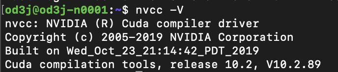

Nvidia Jetson Nano
===
<h3>user: od3j  IP: 192.168.50.157</h3>

|Package       |Version |                                               |
|:------------:|:------:|:---------------------------------------------:|
|nomachine     |6.12.3_5|https://www.nomachine.com/AR02R01074|
|mosquitto     |1.4.15  |                                               |
|go            |1.15.4  |https://golang.org/dl/ (download ARMv8 version)|
|opencv        |4.4.0	  |https://forums.developer.nvidia.com/t/process-to-install-opencv-4-1-on-nano/75801|
|gocv          |0.24.0  |https://github.com/hybridgroup/gocv/releases/tag/v0.24.0|
|cmake         |3.12.4  |https://cmake.org/install/                     |
|jtop          |3.0.2   |https://medium.com/jacky-life/jetson-nano-9d89cbf2fc18|
|vsftp         |		    |https://yanwei-liu.medium.com/nvidia-jetson-tx2學習筆記-六-建立外網可傳輸的ftp伺服器-be1d588c2a43|
|darknet       |		    |                                               |
|jetson-fan-ctl|		    |https://github.com.Pyrestone/jetson-fan-ctl    |

check cuda and cudnn version
-----
```bash
$ nvcc -V
```


install jtop
-----
>https://medium.com/jacky-life/jetson-nano-9d89cbf2fc18  
>查看CPU與GPU相關資訊如溫度與功耗，也能將目前安裝的library顯示出來
```bash
$ sudo apt-get install python-pip python-dev build-essential 
$ sudo pip install --upgrade pip
$ sudo -H pip install jetson-stats
```
#### change power mode (you need to reboot the device)
```bash
$ sudo /usr/sbin/nvpmodel -m 0
$ sudo reboot
```
```
0 => MAXN
1 => 5W
```
install cmake 
-----
>https://cmake.org/install/
#### step 1 : find the correct version and download sourcecode

```bash
$ cd /tmp
$ wget https://github.com/Kitware/CMake/archive/v3.12.4.tar.gz
$ sudo tar -C /tmp -xzf v3.12.4.tar.gz
```

#### step 2 : build cmake

```bash
$ cd CMake-3.12.4
$ sudo ./bootstrap
$ sudo make
$ sudo make install
```
#### step 3 : check cmake version

```bash
$ cmake --version 
```
install go
-----
#### step 1 : Download the archive and extract it into /usr/local
```bash
$ cd /usr/local
$ wget https://golang.org/dl/go1.15.4.linux-arm64.tar.gz
$ tar -C /usr/local -xzf go1.15.4.linux-arm64.tar.gz
```
#### step 2 : Add /usr/local/go/bin to the PATH environment variable
```vim
export PATH=$PATH:/usr/local/go/bin
```
```bash
$ nano $HOME/.profile
$ source $HOME/.profile
```
#### step 3 : check go version
```bash
$ go version
```
install GoCV and OpenCV
-----
>https://github.com/hybridgroup/gocv/releases/tag/v0.24.0  
>https://forums.developer.nvidia.com/t/process-to-install-opencv-4-1-on-nano/75801

#### step 1 : Download GoCV
```bash
$ go get -u -d gocv.io/x/gocv
$ cd go/src/gocv.io/x
$ wget https://github.com/hybridgroup/gocv/archive/v0.24.0.zip
$ unzip gocv-0.24.0.zip
$ rm -rf gocv
$ mv gocv-0.24.0 gocv
```
#### step 2 : Download OpenCV
```bash
$ cd gocv
$ make deps
$ make download # 自動放在/tmp裡

```
#### step 3 : write makefile
```bash
$ cd /tmp/opencv/opencv-4.4.0
$ mkdir build
$ cd build
$ cmake -D CMAKE_BUILD_TYPE=Release \
    -D CMAKE_INSTALL_PREFIX=/usr/local  \
    -D BUILD_PNG=ON \
    -D BUILD_TIFF=OFF \
    -D BUILD_TBB=OFF \
    -D BUILD_JPEG=ON \
    -D BUILD_JASPER=OFF \
    -D BUILD_ZLIB=OFF \
    -D BUILD_EXAMPLES=ON \
    -D BUILD_JAVA=OFF \
    -D BUILD_opencv_python2=OFF \
    -D BUILD_opencv_python3=ON \
    -D WITH_OPENCL=ON \
    -D WITH_OPENMP=ON \
    -D WITH_FFMPEG=ON \
    -D WITH_GSTREAMER=ON \
    -D WITH_CUDA=ON \
    -D WITH_CUDNN=ON \
    -D OPENCV_DNN_CUDA=ON \
    -D CUDA_ARCH_BIN=5.3,6.0,6.1,7.0,7.5 \
    -D CUDA_ARCH_PTX=7.5 \
    -D ENABLE_FAST_MATH=1 \
    -D CUDA_FAST_MATH=1 \
    -D WITH_GTK=ON \
    -D WITH_VTK=OFF \
    -D WITH_TBB=ON \
    -D WITH_1394=OFF \
    -D WITH_OPENEXR=OFF \
    -D CUDA_TOOLKIT_ROOT_DIR=/usr/local/cuda-10.2 \
    -D CUDA_ARCH_PTX="" \
    -D INSTALL_C_EXAMPLES=ON \
    -D INSTALL_TESTS=OFF \
    -D WITH_GSTREAMER_0_10=ON \
    -D OPENCV_TEST_DATA_PATH=../opencv_extra/testdata \
    -D OPENCV_EXTRA_MODULES_PATH=../../opencv_contrib-4.4.0/modules/ \
    -DOPENCV_GENERATE_PKGCONFIG=ON \
    .. | tee ~/cmake.txt
```
#### step 4 : build
```bash
$ make -j9 # 9 means using N-1 CPU
$ sudo make install
$ sudo ldconfig
```
